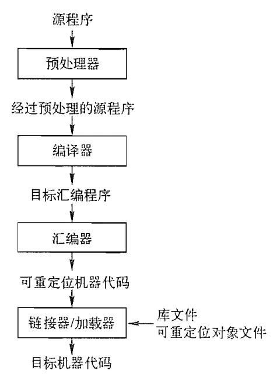
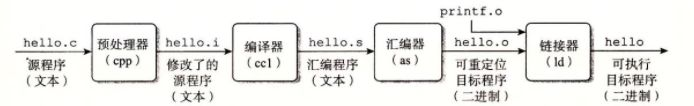
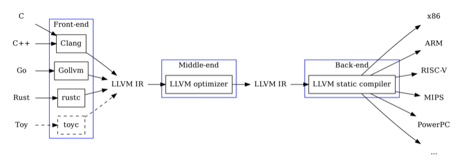

# 预备工作 1：了解编译器、LLVM IR 编程及汇编编程

作者：杨俣哲、李煦阳、孙一丁、李世阳、杨科迪、周辰霏、尧泽斌、时浩铭、贺祎昕、张书睿、华志远、李帅东、唐显达、鲁恒泽、王为。

版本跨度：2020 年 9 月至 2026 年 9 月。

## 目录

1. 实验描述
   - 方法
   - 实验要求
   - 基础样例程序
2. 参考流程
   - 预处理器
   - 编译器
   - 汇编器
   - 链接器与加载器
3. LLVM IR 编程
   - LLVM IR 概述
   - 实验案例
   - SysY 运行时库与程序执行
   - Opaque Pointers
   - 样例 Makefile
4. 汇编编程
   - ARM 汇编编程
   - RISC-V 汇编编程
   - SysY 运行时库

## **1 实验描述**

以你熟悉的编译器，如 GCC、LLVM 等为研究对象，深入地探究语言处理系统的完整工作过程：

1. 完整的编译过程都有什么？

2. 预处理器做了什么？

3. 编译器做了什么？

4. 汇编器做了什么？

5. 链接器做了什么？

6. 通过编写 LLVM IR 程序，熟悉 LLVM IR 中间语言，可以链接 SysY 语言的运行时库。

7. 通过编写汇编程序，熟悉 ARM/RISC-V 汇编语言，可以链接 SysY 语言的运行时库。

并尽可能地对其实现方式有所了解。

### **1.1 方法**

以一个简单的 C（C++）源程序为例，调整编译器的程序选项获得 **各阶段的输出** ，研究它们与源程序的关系，以此撰写调研报告。二进制文件或许需要利用某些系统工具理解，如 `objdump` 、 `nm` 。 进一步地，可以调整你认为关键的 **编译参数** （如优化参数、链接选项参数），比较目标程序的大小、 运行性能等。

你的源程序可以包含尽可能丰富的语言特性（如函数、全局变量、常量、各类宏、头文件...），以更全面探索每一个阶段编译器进行的工作。

### **1.2 实验要求**

#### **要求：**

撰写调研报告（符合科技论文写作规范，包含完整结构：题目、摘要、关键字、引言、你的工作和结果的具体介绍、结论、参考文献，文字、图、表符合格式规范，建议使用 latex 撰写）<sup>1</sup>

（可基于此模板, 该模板所在网站是一个很流行的 latex 文档协同编辑网站，copy 此 project 即可成为自己的项目，在其上编辑即可，更多 latex 参考资料<sup>2</sup> ）。

**期望：** 不要当作“命题作文”，要更多地发挥主观能动性，将其当做实验进行更多探索。如：

1. 细微修改程序，观察各阶段输出的变化，从而更清楚地了解编译器的工作；

2. 调整编译器的程序选项，例如加入调试选项、优化选项等，观察输出变化、了解编译器；

3. 尝试更深入的内容，例如令编译器做自动并行化，观察输出变化、了解编译器。

4. 与预习作业 1 中的优化问题相结合等等。

> 1你可以搜索“vscode+latex workshop”以配置 `latex` 环境，再进一步了解“如何用 latex 书写中文”。

> 2LaTeX 入门、LaTeX 命令与符号汇总、LaTeX 数学公式等符号书写

### **1.3 基础样例程序**

#### 阶乘

```cpp
int main()
{
    int i, n, f;
    cin >> n;
    i = 2;
    f = 1;
    while (i <= n)
    {
        f = f * i;
        i = i + 1;
    }
    cout << f << endl;
}
```

#### 斐波那契数列

```cpp
int main()
{
    int a, b, i, t, n;
    a = 0;
    b = 1;
    i = 1;
    cin >> n;
    cout << a << endl;
    cout << b << endl;
    while (i < n)
    {
        t = b;
        b = a + b;
        cout << b << endl;
        a = t;
        i = i + 1;
    }
}
```

## **2 参考流程**

以下内容仅供参考，更多的细节希望同学们亲自动手体验，详细了解各阶段的作用。 以一个 C 程序为例，整体流程如下：



简单来说，不同阶段的作用如下：

**预处理器** 处理源代码中以 # 开始的预编译指令，例如展开所有宏定义、插入 `#include` 指向的文件等，以获得经过预处理的源程序。

**编译器** 将预处理器处理过的源程序文件翻译成为标准的 **汇编语言** 以供计算机阅读。

**汇编器** 将汇编语言指令翻译成 **机器语言** 指令，并将汇编语言程序打包成可重定位目标程序。

**链接器** 将可重定位的机器代码和相应的一些目标文件以及库文件链接在一起，形成真正能在机器上运行的目标机器代码。

一个 C 程序 `hello.c` 经历上述 4 个编译阶段后生成可执行程序：



下面将详细介绍每个阶段的实验方法（源程序用 main.c 表示）。

### **2.1 预处理器**

预处理阶段会处理预编译指令，包括绝大多数的 # 开头的指令，如 `#include` 、 `#define` 、 `#if` 等等，对 `#include` 指令会替换对应的头文件，对 `#define` 的宏命令会直接替换相应内容，同时会删除注释，添加行号和文件名标识。

对于 gcc， **通过添加参数** **_-E_ 令 gcc 只进行预处理过程** ，参数 _-o_ 改变 gcc 输出文件名，因此通过命令得到预处理后文件：

1 `gcc main.c -E -o main.i`

观察预处理文件，可以发现文件长度远大于源文件，这就是将代码中的头文件进行了替代导致的结果。另外，实际上预处理过程是 gcc 调用了另一个程序（C Pre-Processor 调用时简写作 cpp）完成的过程，有兴趣的同学可以自行尝试。

### **2.2 编译器**

编译过程是我们整门课程着重讲述的过程，具体来说分为六步，详细解释可以查看课程的预习 PPT，简单来说分别为：

**词法分析** 将源程序转换为单词序列。对于 LLVM，你可以通过以下命令获得 token 序列：

1 `clang -E -Xclang -dump-tokens main.c`

**语法分析** 将词法分析生成的词法单元来构建抽象语法树（Abstract Syntax Tree，即 AST）。对于 gcc， 你可以通过 `-fdump-tree-original-raw` flag 获得文本格式的 AST 输出。LLVM 可以通过如下命令获得相应的 AST：

- 1 `clang -E -Xclang -ast-dump main.c`

**语义分析** 使用语法树和符号表中信息来检查源程序是否与语言定义语义一致，进行类型检查等。

**中间代码生成** 完成上述步骤后，很多编译器会生成一个明确的低级或类机器语言的中间表示。

你可以通过 `-fdump-tree-all-graph` 和 `-fdump-rtl-all-graph` 两个 gcc flag 获得中间代码生成的多阶段的输出。生成的 `.dot` 文件可以被 `graphviz` 可视化，vscode 中直接有相应插件。你可以看到控制流图（CFG），以及各阶段处理中（比如优化、向 IR 转换）CFG 的变化。你可以额外使用 `-Ox` 、 `-fno-*` 等 flag 控制编译行为，使输出文件更可读、了解其优化行为。

LLVM 可以通过下面的命令生成 LLVM IR：

- 1 `clang -S -emit-llvm main.c`

**代码优化** 进行与机器无关的代码优化步骤改进中间代码，生成更好的目标代码。

在第一周的预习作业中，很多同学对编译器如何进行代码优化感到疑问，在这个步骤中你可以通过 LLVM 现有的优化 pass 进行代码优化探索。

在 LLVM 官网对所有 pass 的分类<sup>3</sup> 中，共分为三种：Analysis Passes、Transform Passes 和 Utility Passes。Analysis Passes 用于分析或计算某些信息，以便给其他 pass 使用，如计算支配边界、控制流

> 3LLVM 对所有 pass 的简述

图的数据流分析等；Transform Passes 都会通过某种方式对中间代码形式的程序做某种变化，如死代码删除，常量传播等。

LLVM 可以通过下面的命令生成每个 pass 后生成的 LLVM IR，以观察差别：

- 1 `llc -print-before-all -print-after-all a.ll > a.log 2>&1`

- 2 _`#`_ 因为输出的内容过长，在命令行中无法完整显示，这时必须要对输出进行重定向

- 3 _`# 0`_ 、 _`1`_ 、 _`2`_ 是三个文件描述符，分别表示标准输入 _`(stdin)`_ 、标准输出 _`(stdout)`_ 、标准错误 _`(stderr)`_ 4 _`#`_ 因此 _`2>&1`_ 的具体含义就不难理解，你也可以试试去掉重定向描述，看看实际效果同样，你也可以通过下面的命令指定使用某个 pass 以生成 LLVM IR，以特别观察某个 pass 的差别：

- 1 `opt -<module name> <test.bc> /dev/null`

所有的 module name 对应的命令行参数也可以在<sup>4</sup> 查到。

上面的指令需要用到 bc 格式，即 LLVM IR 的二进制代码形式，而我们之前生成的是 LLVM IR 的文本形式（ll 格式）。当然我们也可以通过添加额外命令行参数的方式直接使用 ll 格式的 LLVM IR， 这里留给同学们自行探究。

我们可以通过下面的命令让 bc 和 ll 这两种 LLVM IR 格式互转，以统一文件格式：

- 1 `llvm-dis a.bc -o a.ll` _`# bc`_ 转换为 _`ll`_

- 2 `llvm-as a.ll -o a.bc` _`# ll`_ 转换为 _`bc`_

如果你认为本部分的探索内容过于“黑盒”，你也可以尝试去阅读各大编译器，如 LLVM 各个 pass 的源码<sup>5</sup> 。尽管你现在可能并不了解大多数 pass 实际上是怎么工作的，但可能对你大作业的代码优化部分程序的编写有帮助。

**代码生成** 以中间表示形式作为输入，将其映射到目标语言

- 1 `gcc main.i -S -o main.S` _`#`_ 生成 _`x86`_ 格式目标代码

- 2 `aarch64-linux-gnu-gcc main.i -S -o main.S` _`#`_ 生成 _`arm`_ 格式目标代码

- 3 `llc main.ll -o main.S` _`# LLVM`_ 生成目标代码

### **2.3 汇编器**

汇编过程实际上把汇编语言程序代码翻译成目标机器指令的过程。其最终生成的是可重定位的机器代码。这一步一般被视为编译过程的“后端”，你可以在一些网上资料，比如这里，进行宏观的了解。

> 4LLVM 的 pass 参数

> 5LLVM 源码所在仓库

希望同学们在报告中详细分析并阐述汇编器处理的结果以及汇编器的具体功能分析。你可能会用到反编译工具（你可以在文后的 Makefile 中找到简单的使用示例）。

x86 格式汇编可以直接用 gcc 完成汇编器的工作，如使用下面的命令：

- 1 `gcc main.S -c -o main.o`

arm 格式汇编需要用到交叉编译，如使用下面的命令：

1 `aarch64-linux-gnu-gcc main.S -c -o main.o`

LLVM 可以直接使用 llc 命令同时编译和汇编 LLVM bitcode：

- 1 `llc test.bc -filetype=obj -o test.o`

### **2.4 链接器加载器**

由汇编程序生成的目标文件不能够直接执行。大型程序经常被分成多个部分进行编译，因此，可重定位的机器代码有必要和其他可重定位的目标文件以及库文件链接到一起，最终形成真正在机器上运行的代码。进而链接器对该机器代码进行执行生成可执行文件。可以尝试对可执行文件反汇编，看一看与上一阶段反汇编结果的不同。

在这一阶段，你可以尝试调整链接相关参数，如 `-static` 。

- 1 `gcc main.o -o main`

当你执行可执行文件时，便会使用到加载器，以将二进制文件载入内存。这不是我们要研究的范围了。

## **3 LLVM IR 编程**

### **3.1 LLVM IR 概述**

LLVM IR（Intermediate Representation）是由代码生成器自顶向下遍历逐步翻译语法树形成的， 你可以将任意语言的源代码编译成 LLVM IR，然后由 LLVM 后端对 LLVM IR 进行优化并编译为相应平台的二进制程序。LLVM IR 具有类型化、可扩展性和强表现力的特点。LLVM IR 是相对于 CPU 指令集更为高级、但相对于源程序更为低级的代码中间表示的一种语言。从上述介绍中可以看出 LLVM 后端支持相当多的平台，我们无须担心操作系统等平台的问题，而且我们只需将代码编译成 LLVM IR， 就可以由优化水平较高的 LLVM 后端来进行优化。此外，LLVM IR 本身更贴近汇编语言，指令集相对底层，能灵活地进行低级操作。

LLVM IR 代码存在三种表示形式：在内存中的表示（BasicBlock、Instruction 等 cpp 类）、二进制代码形式（用于编译器加载）、可读的汇编语言表示形式。除了上面提到的 `clang -S -emit-llvm main.c` ， 你也可以通过 `clang -c -emit-llvm main.c -o mian.bc` 生成 bitcode 形式的 LLVM IR 文件。



*图 3.1 LLVM IR 设计架构*

### **3.2 实验案例**

下面以一个基础样例程序（示例给的 **阶乘** 程序）为例对 LLVM IR 特性进行简单介绍。更多有关 LLVM IR 的结构问题，可以参考LLVM Programmer Manual。

首先你需要在命令行中输入 `clang -emit-llvm -S main.c -o main.ll` ，打开同目录下的 `main.ll` 文件，你可以得到以下内容（本指导书已删除无用语句，加入 llvm IR 相关注释及其与 SysY 语言特性的对应关系）：

```llvm
; 所有的全局变量都以@ 为前缀，后面的global 关键字表明了它是一个全局变量
; SysY 语言中注释的规范与C 语言一致
; 函数定义以`define` 开头，i32 标明了函数的返回类型，其中`main`是函数的名字，`@` 是 其前缀
; FuncDef ::= FuncType IDENT "(" [FuncFParams] ")" Block; FuncDef 表示函数定义，  FuncType 指明了函数的返回类型，FuncParam 是函数定义的形参列表
define i32 @main() #0 {
; 以% 开头的符号表示虚拟寄存器，你可以把它当作一个临时变量（与全局变量相区分），或称 之为临时寄存器
%1 = alloca i32, align 4
; 为%1 分配空间，其大小与一个i32 类型的大小相同。%1 类型即为i32*，align 4 可以理 解为对齐方式为4 个字节
%2 = alloca i32, align 4
%3 = alloca i32, align 4
%4 = alloca i32, align 4
; 将0（i32）存入%1（i32*）
store i32 0, i32* %1, align 4
; 调用函数@scanf ，i32 表示函数的返回值类型
%5 = call i32 (i8*, ...) @__isoc99_scanf(i8* getelementptr inbounds ([3 x i8],  [3 x i8]* @.str, i64 0, i64 0), i32* %3)
store i32 2, i32* %2, align 4
store i32 1, i32* %4, align 4
; 这里的br 是无条件分支，label 可以理解为一个代码标签，指代下面那个代码块
br label %6

6:                        ; preds = %10, %0
%7 = load i32, i32* %2, align 4
%8 = load i32, i32* %3, align 4
; icmp 会根据不同的比较规则（这里是sle，小于等于）比较两个操作数%7 和%8，i32 是操作 数类型
%9 = icmp sle i32 %7, %8
; 这里的br 是有条件分支，它根据i1 和两个label 的值，用于将控制流传输到当前函数中 的不同基本块。
; i1 类型的变量%cmp 的值如果为真，那么执行label%10，否则执行label%16
br i1 %9, label %10, label %16

10:                        ; preds = %6
%11 = load i32, i32* %4, align 4
%12 = load i32, i32* %2, align 4
%13 = mul nsw i32 %11, %12
store i32 %13, i32* %4, align 4
%14 = load i32, i32* %2, align 4
%15 = add nsw i32 %14, 1
store i32 %15, i32* %2, align 4
br label %6, !llvm.loop !10

16:                        ; preds = %6
%17 = load i32, i32* %4, align 4
%18 = call i32 (i8*, ...) @printf(i8* getelementptr inbounds ([4 x i8], [4 x  i8]* @.str.1, i64 0, i64 0), i32 %17)
ret i32 0
}
; 函数声明
declare dso_local i32 @__isoc99_scanf(i8*, ...)

declare dso_local i32 @printf(i8*, ...)
```

根据上述 `.ll` 文件，我们对 LLVM IR 及 SysY 特性做以下总结：

1. LLVM IR 的基本单位称为 `module` （只要是单文件编译就只涉及单 `module` ），对应 SysY 中的 `CompUnit` —— `CompUnit ::= [CompUnit] (Decl | FuncDef)` ，一个 `CompUnit` 中有且仅有一个 `main` 函数定义，是程序的入口。

2. 一个 `module` 中可以包含多个顶层实体，如 `function` 和 `global variable` ， `CompUnit` 的顶层变量/常量声明语句（对应 Decl），函数定义（对应 FuncDef）都不可以重复定义同名标识符（IDENT）， 即便标识符的类型不同也不允许。

3. 一个 `function define` 中至少有一个 `basicblock` 。 `basicblock` 对应 SysY 中的 `Block` 语句块，语句块内声明的变量的生存期在该语句块内。 `Block` 表示为 Block ::= “{” BlockItem “}”; BlockItem ::= Decl | Stmt;

4. 每个 `basicblock` 中有若干 `instruction` ，且都以 `terminator instruction` 结尾。SysY 中语句表示为 Stmt ::= LVal “=” Exp ”;“ | [Exp] “;” | Block | “if” “(” Exp “)” Stmt [“else” Stmt] | “while” “(” Exp “)” Stmt | “break” “;” | “continue” “;” | “return” [Exp] “;”;

5. llvm IR 中注释以 “ `;` ” 开头，而 SysY 中与 C 语言一致。

6. llvm IR 是静态类型的，即每个值的类型在编写时是确定的。

7. llvm IR 中全局变量和函数都以 `@` 开头，且会在类型（如 i32）之前用 `global` 标明，局部变量以 `%` 开头，其作用域是单个函数，临时寄存器（上文中的%1 等）以升序阿拉伯数字命名。

8. 函数定义的语法可以总结为：define + 返回值 (i32) + 函数名 (@main) + 参数列表 ((i32 %a,i32 %b)) + 函数体 (ret i32 0)，函数声明你可以在 `main.ll` 的最后看到，即用 `declare` 替换 `define` 。 SysY 中函数定义表示为 `FuncDef ::= FuncType IDENT "(" [FuncFParams] ")" Block` 。

9. 终结指令一定位于一个基本块的末尾，如 `ret` 指令会令程序控制流返回到函数调用者， `br` 指令会根据后续标识符的结果进行下一个基本块的跳转， `br` 指令包含无条件（ `br+label` ）和有条件

（ `br+` 标志符 `+truelabel+falselabel` ）两种。

10. `i32` 这个变量类型实际上就指 32 bit 长的 integer，类似的还有 void、label、array、pointer 等。

11. 绝大多数指令的含义就是其字面意思，load 从内存读值，store 向内存写值，add 相加参数，alloca 分配内存并返回地址等。

关于 LLVM IR 可以从官方文档进行更多了解，一些常用的指令<sup>6</sup> 。有关 SysY 语言更多内容可以参考官方文档<sup>78</sup> 。

### **3.3 SysY 运行时库 & 程序执行**

SysY 语言的一些基础设施，如输入输出函数由其运行时库提供，其实际实现为调用 C 语言的标准库函数。本仓库的 [`lib/`](../lib/) 目录包含以下文件：


- `sylib.h sylib.c` ：SysY 语言的运行时库的声明与实现；

- `libsysy_x86.a` ：SysY 语言的 x86 平台运行时库的静态链接库；

- `libsysy_riscv.a` ：SysY 语言的 RISC-V 平台运行时库的静态链接库；

- `libsysy_aarch.a` ：SysY 语言的 ARM 平台运行时库的静态链接库；

- `sylib.so` ：SysY 语言的 x86 平台运行时库的动态链接库，可供 llvm JIT 使用。

你也可以自行编译运行时库：

```makefile
CC ?= clang
AR ?= ar

lib.a: sylib.c
	$(CC) sylib.c -c -o lib.o -static
	$(AR) rcs lib.a lib.o
```

LLVM IR 程序如果需要调用 SysY 运行时函数，必须先声明相应接口。完整函数列表见 [`sylib.h`](../lib/sylib.h)。下面的程序读取并输出一个整数：

```llvm
declare i32 @getint()
declare void @putint(i32)
declare void @putch(i32)

define i32 @main() {
entry:
  %input = call i32 @getint()
  call void @putint(i32 %input)
  call void @putch(i32 10)
  ret i32 0
}
```

可以将程序编译为可执行文件：

```sh
clang -o main main.ll ../lib/libsysy_x86.a
./main
```

也可以通过 LLVM JIT 运行：

```sh
lli -load=../lib/sylib.so main.ll
```

### **3.4 LLVM IR 的 OpaquePointers 介绍**

由于我们 RISC-V 架构编译器使用的 clang 版本为 15.0 以上，该版本的 clang 的 LLVMIR 支持 OpaquePointers 特性，该特性可以简化我们编译器实现数组和指针的难度，同时也可以降低我们编写优化的难度。

在原先的 LLVM IR 中，指针类型需要包含指向的类型，例如 i32* 表示一个指向 32 位整型的指针。[3 x [4 x float]]* 表示一个指向 [3 x [4 x float]] 数组类型的指针。但是在新版本的 LLVM 中，指针不再需要指定类型，统一使用 ptr 表示。

这时可能产生一个疑问：统一用 `ptr` 表示指针后，`load` 如何判断读取的字节数？新版本 LLVM 将具体类型放在 `load`、`getelementptr` 等内存操作指令中。以下面的 C 函数为例：

```c
int f(float A[][3][4])
{
    return A[2][1][1];
}
```

#### 旧版 LLVM IR

```llvm
define i32 @f([3 x [4 x float]]* %0) {
  %2 = getelementptr inbounds [3 x [4 x float]],
       [3 x [4 x float]]* %0, i64 2, i64 1, i64 1
  %3 = load float, float* %2, align 4
  %4 = fptosi float %3 to i32
  ret i32 %4
}
```

#### 使用 Opaque Pointers 的 LLVM IR

```llvm
define i32 @f(ptr %0) {
  %2 = getelementptr inbounds [3 x [4 x float]],
       ptr %0, i64 2, i64 1, i64 1
  %3 = load float, ptr %2, align 4
  %4 = fptosi float %3 to i32
  ret i32 %4
}
```

可从 LLVM Opaque Pointers 文档继续了解该特性。选择 C++ 编写 RISC-V 编译器框架时，可以在 LLVM IR 编程作业中尝试使用它。

### **3.5 样例 Makefile 文件**

```makefile
.PHONY: pre, lexer, ast-gcc, ast-llvm, cfg, ir-gcc, ir-llvm, asm, obj, exe, antiobj,
antiexe

pre:
gcc main.c -E -o main.i

lexer:
clang -E -Xclang -dump-tokens main.c

# 生成`main.c.003t.original`
ast-gcc:
gcc -fdump-tree-original-raw main.c

# 生成`main.ll`
ast-llvm:
clang -E -Xclang -ast-dump main.c

# 会生成多个阶段的文件(.dot)，可以被graphviz 可视化，可以直接使用vscode 插件
# (Graphviz (dot) language support for Visual Studio Code)。
# 此时的可读性还很强。`main.c.011t.cfg.dot`
cfg:
gcc -O0 -fdump-tree-all-graph main.c

# 此时可读性不好，简要了解各阶段更迭过程即可。
ir-gcc:
gcc -O0 -fdump-rtl-all-graph main.c

ir-llvm:
clang -S -emit-llvm main.c

asm:
gcc -O0 -o main.S -S -masm=att main.i

obj:
gcc -O0 -c -o main.o main.S

antiobj:
objdump -d main.o > main-anti-obj.S
nm main.o > main-nm-obj.txt

exe:
gcc -O0 -o main main.o

antiexe:
objdump -d main > main-anti-exe.S
nm main > main-nm-exe.txt

clean:
rm -rf *.c.*

clean-all:
rm -rf *.c.* *.o *.S *.dot *.out *.txt *.ll *.i main
```

## **4 汇编编程**

我们用下面 C 代码为例来介绍 arm 和 RISC-V 汇编编程。

```c
#include <stdio.h>

int a = 0;
int b = 0;

int max(int a, int b)
{
    if (a >= b)
        return a;
    return b;
}

int main(void)
{
    scanf("%d %d", &a, &b);
    printf("max is: %d
", max(a, b));
    return 0;
}
```

### **4.1 ARM 汇编编程**

你可以在这里，或者这里（简易版）获得你需要了解的 arm 架构的知识。它们可能包括，区分 arm 与 thumb 模式（我们应不会使用 thumb 模式）、理解 arm 架构各寄存器（与各状态位）的含义、了解要使用的指令集、理解函数栈是如何增长的，和一些必要的汇编代码编写技巧。

上一任笔者估计，若对 arm 完全不了解，那么大概需要 3 小时的专注时间以理解你需要的全部知识。

#### **代码示例**

```asm
.arch armv8-a ; 定义目标架构为aarch64
.text         ; 表示接下来是代码区
.global    a  ; 声明全局变量a
.bss          ; 表示未初始化数据段
.align    2   ; 4 字节对齐, align n 表示2^n 字节对齐
a:
.zero    4    ; 为a 分配4 字节空间
.global    b
.align    2
b:
.zero    4
.text
.align    2
.global    max
max:
.LFB0:
sub    sp, sp, #16      ; 分配16 字节栈空间
str    w0, [sp, 12]     ; 将参数a (w0) 存入栈上偏移12 的位置
str    w1, [sp, 8]      ; 将参数b (w1) 存入栈上偏移8 的位置
ldr    w1, [sp, 12]     ; 从栈中加载a 到w1
ldr    w0, [sp, 8]      ; 从栈中加载b 到w0
cmp    w1, w0           ; 比较a 和b, 更新PSTATE 寄存器中的条件标志位
blt    .L2              ; 如果a < b, 有条件跳转到.L2
ldr    w0, [sp, 12]     ; 将a 加载到返回值寄存器w0
b      .L3              ; 无条件跳转到.L3
.L2:
ldr    w0, [sp, 8]      ; a < b, 将b 加载到返回值寄存器w0
.L3:
add    sp, sp, 16       ; 恢复栈空间
ret                     ; 函数返回

.section    .rodata     ; 表示只读数据段
.align    3
.LC0:
.string    "%d %d"      ; scanf 的格式化字符串
.align    3
.LC1:
.string    "max is: %d
" ; printf 的格式化字符串
.text
.align    2
.global    main
main:
.LFB1:
stp    x29, x30, [sp, -16]! ; 保存栈帧指针(fp) 和链接寄存器(lr)
mov    x29, sp              ; 设置新的栈帧指针
adrp    x0, b               ; 加载变量b 的高位地址
add    x2, x0, :lo12:b      ; 加载变量b 的完整地址到x2
adrp    x0, a               ; 加载变量a 的高位地址
add    x1, x0, :lo12:a      ; 加载变量a 的完整地址到x1
adrp    x0, .LC0            ; 加载格式化字符串.LC0 的高位地址
add    x0, x0, :lo12:.LC0   ; 加载.LC0 的完整地址到x0
bl    __isoc99_scanf        ; 调用scanf 函数
adrp    x0, a
add    x0, x0, :lo12:a
ldr    w2, [x0]             ; 加载a 的值到w2
adrp    x0, b
add    x0, x0, :lo12:b
ldr    w0, [x0]             ; 加载b 的值到w0
mov    w1, w0               ; 将b 的值(w0) 移动到w1 作为max 的第二个参数
mov    w0, w2               ; 将a 的值(w2) 移动到w0 作为max 的第一个参数
bl    max                   ; 调用max 函数，返回值在w0
mov    w1, w0               ; 将max 的返回值(w0) 移动到w1 作为printf 的参数
adrp    x0, .LC1
add    x0, x0, :lo12:.LC1
bl    printf                ; 调用printf 函数
mov    w0, 0                ; 设置main 函数返回值为0
ldp    x29, x30, [sp], 16   ; 恢复fp 和lr
ret                         ; main 函数返回
```

#### **代码说明**

这其中有一系列的指令是编译器指令，作用是告知编译器要如何编译，通常以. 开始，其他指令则为汇编指令。

对每个函数的声明，观察可以发现一般首先为

```asm
.text
.global functionname
.type functionname, %function
```

即声明为代码段，将函数名添加到全局符号表中，声明类型为函数。

对全局变量与常量的声明，示例中已经给得比较详细，另外对于数组的使用，可以看到在声明时是毫无特殊的，而在使用时地址则为 _varname+offset_ ，其中偏移量即为数据类型大小乘个数。

另外值得说明的是，在进行函数调用时，一般前四个函数参数使用 r0-r3 号寄存器进行传参，其余参数压入栈中进行传参，往往按照从右至左的顺序逐个压栈；在函数返回时，一般来讲默认将函数的返回值放到 r0 寄存器中。

我们可以发现汇编与 C 的不同：汇编的语言要素就是“标签”（指示地址）、寄存器移动/计算指令。尤其标签的灵活使用：上述汇编代码中利用 `_bridge` 标签，“桥接”了在 C 代码中隐性的全局变量的地址。

某前辈曾说，编程语言理论，建立在“组合”之上——组合意味着复用，意味着抽象。在理解汇编代码时，我们希望将“理解其抽象、其作为整体的语义”作为思考目标（操作系统课或许会接触一些乍一看难理解汇编代码）；在编写程序时，也常常是自顶向下的思维过程。

#### **代码逐行解析**

1. `.arch armv8-a` : 定义目标架构为 AArch64 (ARMv8-a)。

2. `.bss` 与 `.zero 4` : 在 BSS 段为全局变量 `a` 和 `b` 分配未初始化的 4 字节空间。

3. `.section .rodata` 与 `.string` : 在只读数据段定义 `scanf` 和 `printf` 需要的格式化字符串。

4. `.global max` 与 ``max:`` : 声明一个全局可见的函数 `max` 。

5. `max` 函数实现:

   - `sub sp, sp, #16` : 在栈上分配 16 字节空间。

   - `str w0, [sp, 12]` : 将第一个参数（在 `w0` 寄存器中）存入栈。

   - `cmp w1, w0` : 比较两个参数。这会更新 PSTATE 寄存器中的条件标志位。

   - `blt .L2` : 如果第一个参数小于第二个参数（Branch if Less Than），则跳转到 `.L2` 标签。

   - `ldr w0, [sp, 12]` : 如果大于等于，将第一个参数的值加载到返回值寄存器 `w0` 。

   - `ret` : 函数返回，返回值在 `w0` 中。

6. `.global main` 与 ``main:`` : 声明程序入口 `main` 函数。

7. `main` 函数实现:

   - `stp x29, x30, [sp, -16]!` : 函数序言：将栈帧指针 `x29` (fp) 和链接寄存器 `x30` (lr) 同时压入栈中，并更新栈顶指针 `sp` 。

   - `mov x29, sp` : 设置新的栈帧指针。

   - `adrp/add` : 这两条指令组合使用，用于加载全局变量或字符串常量的完整 64 位地址到寄存器中。

   - `bl __isoc99_scanf` : 调用 C 库函数 `scanf` 。根据调用约定，前三个参数（格式化字符串地址、变量 a 的地址、变量 b 的地址）已提前放入 `x0` , `x1` , `x2` 寄存器。

   - `ldr w2, [x0]` : 将内存地址（在 `x0` 中）中的值加载到 32 位寄存器 `w2` 。这里是加载变量 `a` 的值。

   - `bl max` : 调用 `max` 函数。参数已提前放入 `w0` 和 `w1` 。

   - `mov w0, 0` : 设置 `main` 函数的返回值为 0。

   - `ldp x29, x30, [sp], 16` : 函数尾声：从栈中恢复 `x29` 和 `x30` ，并更新栈指针。

   - `ret` : 从 `main` 函数返回。

**代码测试** 当你写完汇编程序（比如 `example.S` ）后，使用下述指令即可测试它。

`aarch64-linux-gnu-gcc example.S -o example.out qemu-aarch64 -L /usr/aarch64-linux-gnu ./example.out` _`# -L`_ 参数用于指定动态链接库的路径，你也可以在编译时使用 _`-static`_ 参数来生成静态链接的可执行文件当然，你可以让测试过程更“自动化”些，将它加入 Makefile，并利用管道测试默认样例、生成结果。<sup>9</sup> 。

1 `.PHONY:test,clean`

2 `test:`

3 `aarch64-linux-gnu-gcc example.S -o example.out`

4 `qemu-aarch64 -L /usr/aarch64-linux-gnu ./example.out`

5 `clean:`

6 `rm -fr example.out`

### **4.2 RISC-V 汇编编程**

为了便于对比学习，我们仍然以 ARM 汇编编程当中的 C 代码为例来介绍 Risc-V 汇编编程。你需要注意我们本学期实验中，RISC-V 的编译器框架使用的均为 64 位 RISC-V 指令集，不要弄错看成 32 位的了 (不过 32 位和 64 位差别很小，你可以通过先学习 32 位再转 64 位的方式来学习)。你可以通过

> 9若您还没有配置好 arm 环境，请参考《编译器开发环境》实验指导。

查阅RISC-V 指令手册来获取完整的 RISC-V 指令集的知识。还有一个中文版本的指令手册，RISC-V 指令手册中文版本。你还可以自行使用搜索引擎搜索或者询问 chat-gpt 来了解快速掌握 RISC-V 指令集的方法。

在本学期的所有实验中，我们只需要了解 RISC-V 的基础指令集，以及 M 扩展 (乘除法)，F 和 D 扩展 (浮点数指令集) 即可，所以你只需要阅读手册的一部分即可。

#### **代码示例**

```asm
.option nopic
.attribute arch, "rv64i2p1_m2p0_d2p2"
.attribute unaligned_access, 0
.attribute stack_align, 16
.text
.globl    max
max:
mv    a5,a0
bge    a0,a1,.L2
mv    a5,a1
.L2:
sext.w    a0,a5
ret
.section    .rodata.str1.8,"aMS",@progbits,1
.align    3
.LC0:
.string    "%d %d"
.align    3
.LC1:
.string    "max is: %d
"
.section    .text.startup,"ax",@progbits
.align    1
.globl    main
main:
addi    sp,sp,-16
lla    a1,a
lla    a2,b
lla    a0,.LC0
sd    ra,8(sp)
call    scanf
lw    a4,b
lw    a5,a
sext.w    a1,a4
sext.w    a0,a5
call    max
mv  a1,a0
.L5:
lla    a0,.LC1
call    printf
ld    ra,8(sp)
li    a0,0
addi    sp,sp,16
jr    ra
.size    main, .-main
.globl    b
.globl    a
.section    .sbss,"aw",@nobits
.align    2
b:
.zero    4
a:
.zero    4
```

#### **代码说明**

1. `.option nopic` 表示不使用位置无关的代码。此时，汇编器生成的代码将假定它会被加载到固定的内存地址，对于生成静态链接的二进制文件比较重要。一般情况下，‘nopic‘ 和 ‘pic‘ 的差异体现在对 GOT (Global Offset Table) 表的查找

2. `.attribute arch, "rv64i2p1_m2p0_d2p2"` 是用于指定汇编代码所遵循的架构特性和扩展的指令。

`rv64i2p1` 表示代码遵循 RISC-V 64 位基础证书指令集，版本为 2.1.

`m2p0` 表示支持乘法和除法指令，版本为 2.0. 其余的指令大家可以通过搜索均可查到相关意义，此处不再赘述。

`d2p2` 表示支持双精度浮点数指令，版本为 2.2.

3. “ `.attribute unaligned_access, 0` ”表示不允许非对齐访问，在我们 RISC-V 版本的编译实验作业中，同样需要遵循这一规定.

4. “ `.attribute stack_align, 16` ”表示栈空间需要 16 字节对齐，在我们 RISC-V 版本的编译实验作业中，同样需要遵循这一规定.

5. “ `.text` ”表示接下来是代码区

6. 接下来我们介绍 max 函数中出现的汇编指令首先我们需要了解一点，RISC-V 函数调用约定中参数的传递首先使用 a0-a7 寄存器，如果寄存器不够用，则使用栈进行传递。所以在函数入口处，a0 存放着变量 a 的值，a1 存放着变量 b 的值。

`"mv a5 a0"` 的含义将 a0 的值移动到 a5 中，即 a5 = a0。这里使用 a5 寄存器来存放最大值， 初始时假设 a0 的值为最大值。

`"bge a0,a1,.L2"` 的含义为如果 a0 _≥_ a1，则跳转至.L2，对应源代码的 if(a>=b)。否则没有其它动作

`"mv a5,a1"` 的含义为将 a1 的值移动到 a5 中，即 a5 = a1。这一条语句在 a>=b 为假的分支执行，表示将最大值 a1(存放着变量为 b 的值，此时有 b > a) 赋值给 a5。

`"sext.w a0,a5"` 表示将 32 位的 a5 符号扩展到 64 位，值存放到 a0 中。

`"ret"` 表示函数返回，即源代码中的 return。根据 RISC-V 函数调用约定，使用 a0 寄存器存放函数的返回值。

`.align 3` 表示之前有一段未对齐的代码或数据，汇编器会在这段内容前插入适当数量的填充字节，以确保接下来的数据或代码从一个 8 字节对齐的地址开始。这样做可以提高内存访问效率和程序的运行性能。

7. “ `.LC0` 和 `.LC1` ”这些标签定义了字符串常量

8. 接下来介绍 main 函数中出现的汇编指令

`"addi sp,sp,-16"` 首先我们需要知道 sp 寄存器指向栈顶，该条指令的含义为开辟 16 字节的栈空间

`"lla a2,b"` 、 `"lla a1,a"` 和 `"lla a0,.LC0"` ：lla 是一个伪指令，用于加载符号的地址到寄存器中。这里分别将全局变量 b 的地址、a 的地址以及格式化字符串.LC0 (”%d %d”) 的地址加载到寄存器 a2 、a1 和 a0 中。

`"call scanf"` ：调用 scanf 函数。根据 RISC-V 的函数调用约定，a0 , a1 , a2 分别存放了 scanf 所需的三个参数：格式化字符串的地址、变量 a 的地址和变量 b 的地址。

`"lla a5,a"` 和 `"lw a4,0(a5)"` ：首先将变量 a 的地址加载到 a5 ，然后通过 lw (Load Word) 指令从该地址加载 a 的值到 a4 寄存器。

`"lla a5,b"` 和 `"lw a5,0(a5)"` ：同理，加载变量 b 的值到 a5 寄存器。

`"mv a1,a5"` 和 `"mv a0,a4"` ：mv 是一个伪指令。这里将 b 的值（在 a5 中）移动到 a1 ，将 a 的值（在 a4 中）移动到 a0 。这是为了准备调用 max 函数，a0 和 a1 将作为 max 函数的两个参数。

- `"call max"` ：调用 max 函数。此时 a0 和 a1 中分别存放着 a 和 b 的值。函数返回值将存放

- 在 a0 中。

`"mv a5,a0"` 和 `"mv a1,a5"` ：将 max 函数的返回值（在 a0 中）先移动到 a5 ，再移动到 a1

- 。此时 a1 中存放了 max(a, b) 的结果，作为 printf 函数的参数。

`"lla a0,.LC1"` ：加载格式化字符串.LC1 (”max is: %d

n”) 的地址到 a0 ，作为 printf 的第一个参数。

`"call printf"` ：调用 printf 函数。

`"li a5,0"` 和 `"mv a0,a5"` ：li (Load Immediate) 是一个伪指令，将立即数 0 加载到 a5 ，然后移动到 a0 。这设置了 main 函数的返回值为 0。

`"ld ra,8(sp)"` 和 `"ld s0,0(sp)"` ：ld (Load Doubleword) 指令从栈中恢复之前保存的返回地址寄存器 ra 和被调用者保存寄存器 s0 。

`"addi sp,sp,16"` ：恢复栈指针，释放之前分配的 16 字节栈空间。

`"jr ra"` ：jr (Jump Register) 是一个伪指令，跳转到 ra 寄存器中保存的地址，实现从 main 函数返回。

9. 最后还有一些全局变量的定义，从文本上很容易理解其含义，这里就不赘述了。

10. 上述的 RISC-V 汇编由 riscv64-unknown-elf-gcc O2 编译选项编译而成（做了适当修改，如避免 max 函数的内联）。如果你想了解编译器在不同优化等级下生成的汇编代码的差异，可以尝试使用不同的选项进行编译。

**RISC-V 内存模型** RISC-V 目前常用内存模型包括 medlow 和 medany。前者只能布局在 _±_ 2 _GB_ 的地址空间，而后者却可以布局在整个 64 位地址空间。本学期的实验作业建议使用 medany 内存模型完成。鉴于它与我们本学期实验作业相关性并不大，因此仅做简要说明。对此感兴趣的同学可自行查阅相关资料或咨询助教。

内存模型的不同反应到实验中汇编代码编写与后端代码中的区别其实只有一点，即寻址方式的不同。在 RISC-V 中，我们一般会选择使用下面三种寻址方式：

- `"lui + add"` : lui 指令用于加载一个 20 位的立即数到寄存器的高 20 位，addi 指令用于将一个 12 位的立即数加到寄存器的低 12 位。通过这种方式，可以构造出一个完整的 32 位地址。但显

然的，这样构造出的 32 位地址难以定位 0x80000000 及以上的地址空间，更别说整个 64 位地址空间了。这也是要求实验中将程序基址设为 0x90000000 的原因。

- `"auipc + add"` : auipc 与 lui 指令类似，但它除了加载高 20 位立即数外，还会将当前指令的地址加上这个高 20 位立即数，再加上低 12 位立即数，也就是构造一个 32 位立即数再加上当前 PC。因此，aupic 的寻址范围是 PC _±_ 2GB。而 PC 的范围是整个 64 位地址空间，因此 aupic + addi 可以寻址整个 64 位地址空间。

- `la lla` : la 与 lla 均为伪指令，实际链接时会被替换为上面两类寻址方式。其中 la 会根据链接采用的内存模型选择 lui + addi 或 auipc + addi 进行替换，而 lla 则总是被替换为 auipc + addi。

因此，这里主要是提醒同学们在实验时如需加载全局变量或字符串常量的地址时，应当使用后面两种方式，而不是 lui + addi 的组合。在超越 medlow 模型寻址范围的情况下，若使用 lui 对全局变量寻址，那么在重定位时就会出现被截断的 R_RISCV_HI20 错误。 当然，可能会有同学想到下面两种寻址方式：

- `"lui + add + addi"` : 通过 add pc 来实现 auipc 的功能。这一想法并不现实，因为 RISC-V 并不支持 pc 寄存器作为 add 指令的操作数。当然你也可以通过 call .+4 这样扭曲的方式将 pc 放到 ra 后再做加法，但这显然不是一个好的方案。

- `"lui + addi + slli"` : 通过组合两个 32 位的立即数来构造一个 64 位地址。这个方案显然在理论上是可行的，但现在也确实不支持。对于其中的具体原因，助教也不是很清楚，大概是因为目前 RISC-V 的应用场景还没有到需要使用完整 64 位寻址的地步吧。当然更可能的一点是这一寻址方式较为复杂，会引入更多的指令与更大的开销。

**对编写的 RISC-V 汇编进行测试** 假设你编写了一个 RISC-V 汇编文件，命名为 test.s，使用下面的命令即可进行测试。

`riscv64-unknown-elf-gcc test.s -o test -static -Wl,--no-relax,-Ttext=0x90000000` _`#`_ 如果你好奇为什么要加 _`-static`_ ，可以取消 _`-static`_ 后使用 _`qemu`_ 运行试试，看看会报什么错误 _`#`_ 你可以再根据错误信息去搜索引擎上搜索或者询问 _`chat-gpt`_ 来了解原因。 `qemu-riscv64 test`

### **4.3 SysY 运行时库**

如前文所说，SysY 的输入输出等功能主要依赖于运行时库的支持。你可以在飞书群提供的资料中找到 RISC-V 和 AArch64 架构的 SysY 运行时链接库。与 LLVM IR 编程不同的是，汇编编程中不需要提前声明使用到的外部函数，也就是说你并不需要在代码中显式地声明这些函数就可以直接调用。 当你完成汇编代码的编写练习后，可以使用下面的命令来编译并链接运行时库。

> _`# RISC-V`_ `riscv64-unknown-elf-gcc main.s -c -o main.o -w riscv64-unknown-elf-gcc main.o -o main` **`\`**

> `-L./lib -lsysy_riscv` **`\`**

> `-static -mcmodel=medany` **`\`**

> `-Wl,--no-relax,-Ttext=0x90000000`

> `qemu-riscv64 ./main`

> _`# ARM`_

```
aarch64-linux-gnu-gccmain.s-c-omain.o-w-static
aarch64-linux-gnu-gccmain.o-omain-L./lib-lsysy_aarch-static
qemu-aarch64./main
```
